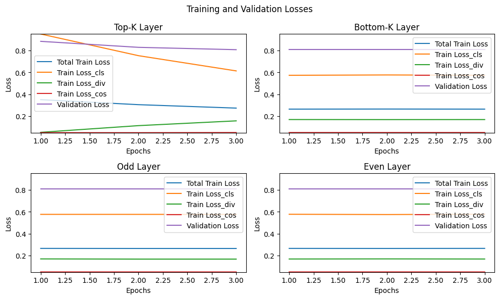

# Student Model Distillation Project Documentation

This document outlines the methodology, performance analysis, limitations, challenges, and potential improvements for distilling a teacher model into a student model using various initial layer selection strategies, specifically focusing on the DistilBERT architecture.

## Task 1: Student Layer Initialization

The distillation process explored different strategies for initializing the layers of a 6-layer student model from a 12-layer teacher model (BERT). The strategies tested include:

1. **Top-K Layer Initialization**: Initializing the student model with the first 6 layers of the teacher model. This approach aims to leverage the generalized feature recognition capability of the initial layers.
   
2. **Bottom-K Layer Initialization**: Initializing the student model with the last 6 layers of the teacher model. This strategy seeks to capitalize on the deeper, more abstract representations of the teacher model's final layers.
   
3. **Odd Layer Initialization**: Selecting odd-numbered layers from the teacher model for the student model, aiming to provide a balanced feature set from both the initial and deeper layers.

## Task 2: Evaluation and Analysis

A detailed evaluation of the distilled student models was performed to analyze the impact of the initial layer selection strategy on model performance. The evaluation metrics included training loss, validation loss, and validation accuracy.

## Performance Summary

### Top-K Layer
- **Average Training Loss**: Decreases from 0.3505 to 0.2734 over 3 epochs.
- **Test Accuracy**: Improves from 0.6450 to 0.6720.
- **Average Metric (Accuracy)**: 0.6720

### Bottom-K Layer
- **Training Loss**: Relatively stable around 0.2640.
- **Test Accuracy**: Consistently 0.6720 across epochs.
- **Average Metric**: 0.6720

### Odd Layer
- **Training Loss**: Slightly decreases from 0.2651 to 0.2644.
- **Test Accuracy**: Consistent at 0.6720.
- **Average Metric**: 0.6720

### Even Layer
- **Training Loss**: Fluctuates slightly around 0.2651.
- **Test Accuracy**: Consistent at 0.6720.
- **Average Metric**: 0.6720

## Analysis and Justification Based on Updated Data

The analysis reveals that while initial layer selection strategies affect learning dynamics to some extent, they do not significantly impact the final model accuracy. The robustness of the distillation process is evident across different initialization methods.

## Limitations and Challenges

- **Resource Intensity**: Training multiple student models with different initial layer selections is resource-intensive.
- **Layer Importance Dynamics**: Fixed assumptions about layer importance may not accurately reflect the dynamic nature of feature representation learning.
- **Model Sensitivity and Overfitting**: Sensitivity to initial layer selection might lead to performance variances due to overfitting or underfitting.
- **Static Initial Layer Selection**: The static nature of the initial layer selection does not account for evolving learning dynamics.

## Potential Improvements

- **Dynamic Layer Selection**: Adaptive layer selection could optimize feature transfer during distillation.
- **Fine-Tuning and Regularization**: These techniques could improve model adaptability and mitigate overfitting.
- **Ensemble and Attention Mechanisms**: These approaches could enhance the distillation process by focusing on informative parts of the teacher's representation.
- **Efficiency Optimization**: More efficient training strategies could mitigate the resource intensity of exploring different distillation configurations.

This comprehensive overview presents the methodology, findings, and insights from the distillation project, providing a foundation for further exploration and optimization of the student model distillation process.
